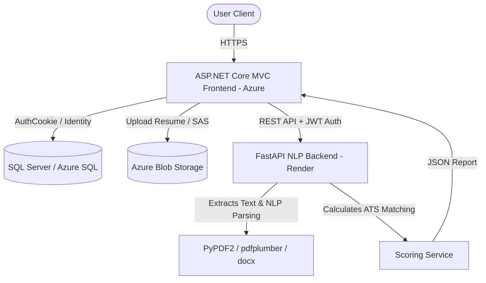

# AI Resume Analyzer & ATS Audit Platform

An enterprise-grade, multi-service Web Application designed for ATS optimization, keyword analysis, and skill gap assessment of candidate resumes.

## Technology Stack

- **Frontend & Orchestration:** ASP.NET Core 8 MVC, Entity Framework Core, ASP.NET Identity, SQL Server (Azure SQL Database)
- **Backend AI Service:** Python 3.12+, FastAPI REST API, spaCy NLP, PyPDF2 & pdfplumber, python-docx
- **Cloud Infrastructure:** Azure App Service, Render.com, Azure Blob Storage, Azure Key Vault support
- **Styling:** Bootstrap 5, Glassmorphism CSS Cards, Custom Light/Dark theme utility, Chart.js

---

## Architecture Flow



---

## Directory Structure

```
├── db/                                  # Database setup schemas
├── src/
│   ├── ResumeAnalyzer.Domain/           # Core Entities & Domain Interfaces
│   ├── ResumeAnalyzer.Infrastructure/   # DBContext, Repositories, Azure & API Services
│   ├── ResumeAnalyzer.Web/              # ASP.NET Core 8 MVC Presentation
│   └── ResumeAnalyzer.Backend/          # Python FastAPI Backend Service
├── docker-compose.yml                   # Local Orchestration Config
├── ResumeAnalyzer.sln                   # Visual Studio Solution
└── README.md
```

---

## Local Setup Instructions

### 1. Backend Service (FastAPI)
Prerequisites: Python 3.12+ (already installed on this machine).

1. Navigate to the backend directory:
   ```bash
   cd src/ResumeAnalyzer.Backend
   ```
2. Create and activate a Python virtual environment:
   ```bash
   python -m venv venv
   # Windows:
   .\venv\Scripts\activate
   ```
3. Install dependencies:
   ```bash
   pip install -r requirements.txt
   ```
4. Download spaCy NLP model & NLTK dependencies:
   ```bash
   python -m spacy download en_core_web_sm
   python -m nltk.downloader stopwords punkt
   ```
5. Start the API server locally:
   ```bash
   uvicorn app.main:app --reload --host 127.0.0.1 --port 8000
   ```
   Access the Swagger API documentation at `http://127.0.0.1:8000/docs`.

### 2. Frontend Web Application (ASP.NET Core)
Prerequisites: .NET 8 SDK (Please install the .NET SDK from https://dotnet.microsoft.com/download/dotnet/8.0).

1. Open the solution in Visual Studio 2022 or use the dotnet CLI:
   ```bash
   dotnet restore ResumeAnalyzer.sln
   ```
2. Set up database configurations in `src/ResumeAnalyzer.Web/appsettings.json`. By default, LocalDB connection is pre-configured.
3. Apply migrations / initialize DB schema:
   ```bash
   cd src/ResumeAnalyzer.Web
   dotnet run
   ```
   *Note: Database tables, default roles ("Admin", "Candidate"), subscription tiers, and a default admin user (`admin@resumeanalyzer.ai` / `AdminPass123!`) will seed automatically on first startup.*

---

## Orchestrating with Docker Compose

To run the entire system including SQL Server, Python Backend, and ASP.NET Core Frontend in isolated containers:

```bash
docker-compose up --build
```
- **Frontend URL:** `http://localhost:8080`
- **Backend Swagger URL:** `http://localhost:8000/docs`
- **SQL Server Port:** `1433`

---

## Verification & Testing

Verify Python endpoints locally by running unit tests:
```bash
cd src/ResumeAnalyzer.Backend
pytest
```
